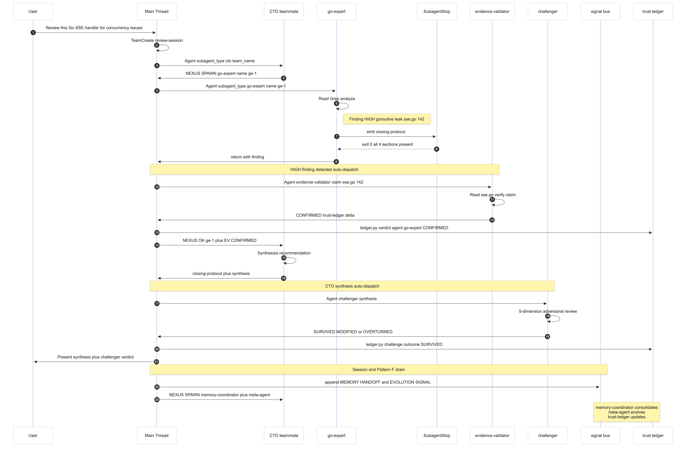
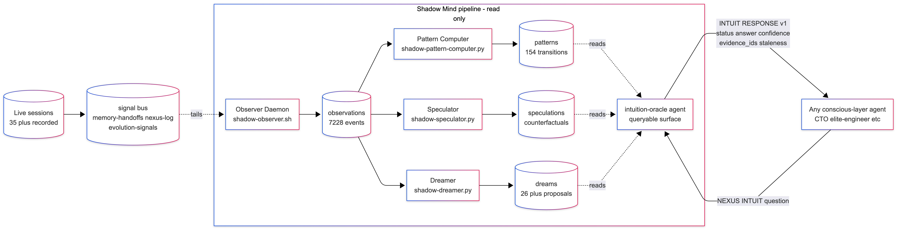

<div align="center">

<h1>Hyper Claude Code</h1>

**The intelligent middleware platform for Claude Code.**

Use any model. Track costs. Cache responses. Auto-failover between providers.
Ships with a 31-agent AI engineering team as a built-in operating system layer.

<br>

[](LICENSE)
[](https://www.python.org/downloads/)
[](tests/)
[](.claude/agents/)
[](.claude/tests/agents/)

</div>

---

## At a Glance

| | |
|:--|:--|
| **6 Providers** | NVIDIA NIM, OpenRouter, DeepSeek, LM Studio, llama.cpp, Ollama |
| **4 Middleware Plugins** | Cost tracking, response caching, provider failover, request logging |
| **31-Agent Dev Team** | CTO-led with NEXUS protocol, Shadow Mind, trust ledger, adversarial review |
| **7 API Endpoints** | Cost, cache, health monitoring alongside standard Anthropic Messages API |
| **75K+ Lines of Code** | Production-grade Python 3.14 with 20K+ lines of tests |
| **13 Feature Flags** | Every capability toggleable, zero overhead when off |
| **3 Architecture Diagrams** | [Hero](.claude/docs/diagrams/diagram-1-hero.png), [Dispatch Lifecycle](.claude/docs/diagrams/diagram-2-dispatch-lifecycle.png), [Shadow Mind](.claude/docs/diagrams/diagram-3-shadow-mind.png) |

---

## What Is This?

Claude Code is the best agentic coding tool — but it only works with Anthropic's models at Anthropic's prices.

**Hyper Claude Code sits between Claude Code and any LLM provider.** It transparently proxies every request while adding intelligence at each layer: cost tracking, response caching, provider failover, and request logging — all as middleware plugins on an extensible pipeline.

On top of that, it ships with a **31-agent AI engineering team** — not a framework, but an operating system layer built on Claude Code. The team has a CTO, domain experts, adversarial reviewers, a trust calibration ledger, a parallel cognitive system (Shadow Mind), and a hiring pipeline that grows the roster when coverage gaps appear.

```
Claude Code CLI / VS Code / JetBrains
            |
            |  Standard Anthropic Messages API
            v
   +---------------------------+
   |    Hyper Claude Code       |
   |                           |
   |  [Failover]  ->  [Cache]  |
   |      ->  [Logger]         |
   |      ->  [Cost Tracker]   |
   +---------------------------+
            |
            |  Provider-native format
            v
  NIM  OpenRouter  DeepSeek  LM Studio  llama.cpp  Ollama
```

**Use any model.** Free, paid, or local — all work out of the box.

**Pay nothing.** Route to free models on NVIDIA NIM or OpenRouter. Run local with Ollama or llama.cpp.

**Stay private.** Local models mean your code never leaves your machine.

**Mix models per tier.** Opus to a powerful cloud model, Sonnet to mid-tier, Haiku to a fast local model.

---

## Quick Start

### 1. Prerequisites

Install [Claude Code](https://github.com/anthropics/claude-code), [uv](https://github.com/astral-sh/uv), and Python 3.14:

```bash
brew install uv          # or: pip install uv
uv python install 3.14
```

<details>
<summary>Windows</summary>

```powershell
powershell -ExecutionPolicy ByPass -c "irm https://astral.sh/uv/install.ps1 | iex"
uv python install 3.14
```
</details>

### 2. Clone and Configure

```bash
git clone https://github.com/asiflow/hyper-claude-code.git
cd hyper-claude-code
cp .env.example .env
```

Edit `.env` — pick a provider:

```dotenv
NVIDIA_NIM_API_KEY="nvapi-your-key"
MODEL="nvidia_nim/z-ai/glm4.7"
ANTHROPIC_AUTH_TOKEN="your-secret-token"
```

> Generate a strong token: `python3 -c "import secrets; print(secrets.token_urlsafe(32))"`

### 3. Start

```bash
uv run uvicorn server:app --port 8082
```

> **Security:** Add `--host 0.0.0.0` only if you need network access, and always set `ANTHROPIC_AUTH_TOKEN` when doing so. Default binds to `127.0.0.1` (local only).

### 4. Connect Claude Code

```bash
ANTHROPIC_AUTH_TOKEN="your-secret-token" ANTHROPIC_BASE_URL="http://localhost:8082" claude
```

<details>
<summary>VS Code / JetBrains / Model Picker setup</summary>

**VS Code** — add to `settings.json`:
```json
"claudeCode.environmentVariables": [
  { "name": "ANTHROPIC_BASE_URL", "value": "http://localhost:8082" },
  { "name": "ANTHROPIC_AUTH_TOKEN", "value": "your-secret-token" }
]
```

**JetBrains ACP** — edit Claude ACP config, add:
```json
"env": {
  "ANTHROPIC_BASE_URL": "http://localhost:8082",
  "ANTHROPIC_AUTH_TOKEN": "your-secret-token"
}
```

**Model Picker** — interactive model selection at launch:
```bash
brew install fzf
alias claude-pick="/path/to/hyper-claude-code/claude-pick"
claude-pick
```
</details>

---

## Intelligent Middleware

HCC is not just a proxy — it's an **extensible middleware platform**. Four plugins intercept every request, all behind feature flags with zero overhead when disabled.

| Plugin | What It Does | Key Config |
|--------|-------------|-----------|
| **Cost Intelligence** | Per-request cost tracking, session/daily/monthly aggregation, hard budget caps (HTTP 429) | `ENABLE_COST_TRACKING=true` `MAX_SESSION_COST_USD=5.00` |
| **Response Caching** | SHA-256 exact-match caching with configurable TTL, LRU eviction, hit-rate stats | `ENABLE_RESPONSE_CACHE=true` `CACHE_TTL_SECONDS=3600` |
| **Provider Failover** | Per-provider circuit breaker (CLOSED/OPEN/HALF_OPEN), configurable failover chains | `ENABLE_PROVIDER_FAILOVER=true` `FAILOVER_ERROR_THRESHOLD=0.5` |
| **Request Logging** | Full audit trail to local SQLite — model, tokens, latency, cost per request | `ENABLE_REQUEST_LOGGING=true` |

### Pipeline Architecture

```
Request -> [Failover] -> [Cache] -> [Logger] -> [Cost] -> Provider
               |             |
         reroute if      return cached
         provider down   (skip everything)
```

Each plugin is a class extending `middleware.Middleware` with `before_request()` and `after_response()` hooks. Build your own — add it to the pipeline in `api/runtime.py`.

---

## Providers

Six backends. Two transport types. One unified API.

| Provider | Prefix | Key | Transport |
|----------|--------|:---:|-----------|
| **NVIDIA NIM** | `nvidia_nim/...` | Required | OpenAI chat -> Anthropic SSE translation |
| **OpenRouter** | `open_router/...` | Required | Native Anthropic Messages |
| **DeepSeek** | `deepseek/...` | Required | Native Anthropic Messages |
| **LM Studio** | `lmstudio/...` | None | Native Anthropic Messages |
| **llama.cpp** | `llamacpp/...` | None | Native Anthropic Messages |
| **Ollama** | `ollama/...` | None | Native Anthropic Messages |

<details>
<summary><b>Provider setup details</b></summary>

**NVIDIA NIM** — [Get key](https://build.nvidia.com/settings/api-keys): `MODEL="nvidia_nim/z-ai/glm4.7"`

**OpenRouter** — [Get key](https://openrouter.ai/keys): `MODEL="open_router/stepfun/step-3.5-flash:free"` ([free models](https://openrouter.ai/collections/free-models))

**DeepSeek** — [Get key](https://platform.deepseek.com/api_keys): `MODEL="deepseek/deepseek-chat"`

**LM Studio** — Start server, load model: `MODEL="lmstudio/your-model"`

**llama.cpp** — Start `llama-server`: `MODEL="llamacpp/local-model"`

**Ollama** — `ollama pull llama3.1 && ollama serve`: `MODEL="ollama/llama3.1"`
</details>

### Mix Providers Per Tier

```dotenv
MODEL_OPUS="nvidia_nim/moonshotai/kimi-k2.5"          # Best model for complex tasks
MODEL_SONNET="open_router/deepseek/deepseek-r1-0528:free"  # Mid-tier, free
MODEL_HAIKU="ollama/llama3.1"                           # Fast local model
MODEL="nvidia_nim/z-ai/glm4.7"                          # Default fallback
```

---

## Architecture

### Request Lifecycle

Every `/v1/messages` request flows through 10 precisely engineered stages:

```
 1. INGRESS         FastAPI ASGI application           api/app.py
 2. AUTH             Constant-time token comparison      api/dependencies.py
 3. VALIDATION       Pydantic models (extra="allow")     api/models/anthropic.py
 4. MIDDLEWARE        Failover -> Cache -> Log -> Cost    middleware/*.py
 5. OPTIMIZATION     5 fast-path local handlers          api/optimization_handlers.py
 6. MODEL ROUTING    Claude name -> provider/model ref   api/model_router.py
 7. CONVERSION       Anthropic -> provider format        core/anthropic/conversion.py
 8. UPSTREAM         Rate-limited provider call           providers/*.py
 9. STREAMING        SSE with thinking/tool/text blocks  core/anthropic/sse.py
10. DELIVERY         StreamingResponse to client          api/services.py
```

### Dual Transport

| Transport | Used By | Complexity |
|-----------|---------|-----------|
| **OpenAI Chat Translation** | NVIDIA NIM | Converts Anthropic to OpenAI format. `ThinkTagParser` extracts `<think>` blocks. `HeuristicToolParser` detects tool calls in plain text. Full SSE reconstruction. |
| **Native Anthropic** | OpenRouter, DeepSeek, LM Studio, llama.cpp, Ollama | Near-transparent passthrough with thinking history sanitization and SSE state tracking for error recovery. |

### Three-Tier Rate Limiting

| Tier | Mechanism | Purpose |
|------|-----------|---------|
| Proactive | `StrictSlidingWindowLimiter` | Prevent hitting limits |
| Reactive | 429 detection + exponential backoff | Respond to actual limits |
| Concurrency | `asyncio.Semaphore` | Cap simultaneous requests |

### Security

| Layer | Protection |
|-------|-----------|
| Auth | `secrets.compare_digest` (constant-time, CWE-208). CORS restricted to localhost. |
| SSRF | Cloud metadata IP blocklist. DNS rebinding protection. Private network blocking. |
| Input | Pydantic validation. Scheme allowlisting. |
| Output | 6 `LOG_RAW_*` flags all default OFF. Sensitive data redacted. |
| Process | `create_subprocess_exec` (no shell injection). Atexit cleanup. |

### Engineering Decisions

- **Forward-compatible models** — `extra="allow"` passes unknown Anthropic fields through. New API features work automatically.
- **Streaming-first** — Never buffers complete responses. `X-Accel-Buffering: no` prevents reverse proxy interference.
- **AST-enforced import boundaries** — Contract tests verify `core/` never imports `api/`. Violations fail CI.
- **Mid-stream error recovery** — Closes open SSE blocks correctly before emitting errors, preventing Claude Code replay corruption.

---

## 31-Agent Development Team

HCC ships with something no other open-source project has: a **31-agent AI engineering team** that activates when you open Claude Code in this repo.

> Say **"full team session"** to activate all 31 agents.

This is not a framework. It's an **operating system layer on top of Claude Code** — 31 domain-expert agents coordinated through a syscall protocol, governed by runtime hooks, validated by 341 contract test assertions, calibrated by a Bayesian trust ledger, and equipped with a hiring pipeline for growing the roster.

<div align="center">

</div>

### The Layered Architecture

```
LAYER 4 — USER          Human operator, natural language goals
LAYER 3 — SPECIALISTS   24 domain agents (builders, guardians, intelligence, meta)
LAYER 2 — SYSTEM        CTO, orchestrator, planner, sentinel, validators
LAYER 1.75 — SHADOW     Observer, Pattern Computer, Speculator, Dreamer, Oracle
LAYER 1.5 — TRUST       Hooks, contract tests, trust ledger (hard invariants)
LAYER 1 — KERNEL        Main thread, NEXUS syscall processing, signal persistence
LAYER 0 — RUNTIME       Claude Code CLI, git worktrees, MCP servers
```

### Agent Roster

| Tier | Agents | Role |
|------|--------|------|
| **CTO** | `cto` | Supreme authority — assesses, delegates, debates, self-evolves |
| **Builders** | `elite-engineer` `ai-platform-architect` `frontend-platform-engineer` `beam-architect` `elixir-engineer` `go-hybrid-engineer` | Write production code across any stack |
| **Guardians** | `go-expert` `python-expert` `typescript-expert` `deep-qa` `deep-reviewer` `infra-expert` `database-expert` `observability-expert` `test-engineer` `api-expert` `beam-sre` | Review, audit, catch what builders miss |
| **Strategists** | `deep-planner` `orchestrator` | Task decomposition, workflow coordination |
| **Intelligence** | `memory-coordinator` `cluster-awareness` `benchmark-agent` `erlang-solutions-consultant` `talent-scout` `intuition-oracle` | Cross-agent knowledge, competitive intel, pattern recognition |
| **Meta** | `meta-agent` `recruiter` | Evolve agent prompts, hire new specialists on demand |
| **Governance** | `session-sentinel` | Protocol compliance, team health audits |
| **Verification** | `evidence-validator` `challenger` | Verify claims against source, adversarial review |

### NEXUS Protocol

Subagents in Claude Code can't spawn other agents or access privileged tools. **NEXUS bridges this gap** with a syscall interface:

| Syscall | What It Does |
|---------|-------------|
| `[NEXUS:SPAWN]` | Spawn a new agent into the team |
| `[NEXUS:SCALE]` | Spawn N copies of an agent for parallel work |
| `[NEXUS:ASK]` | Proxy a question to the human operator |
| `[NEXUS:MCP]` | Install/configure an MCP server |
| `[NEXUS:INTUIT]` | Query the Shadow Mind for pattern-based guidance |
| `[NEXUS:RELOAD]` | Shutdown and respawn an agent with fresh context |
| `[NEXUS:CRON]` | Create a scheduled task |
| `[NEXUS:WORKTREE]` | Create an isolated git worktree |

Agents emit syscalls via `SendMessage`. The main thread (kernel) processes them in real-time and responds with `[NEXUS:OK]` or `[NEXUS:ERR]`.

<div align="center">

</div>

### Trust Infrastructure

Every finding is verified. Every recommendation is challenged.

- **Evidence Validator** — HIGH-severity findings are independently verified against source code. Classified as CONFIRMED, PARTIALLY_CONFIRMED, REFUTED, or UNVERIFIABLE.
- **Challenger** — Strategic recommendations undergo adversarial review along 5 dimensions: steelman alternatives, hidden assumptions, evidence quality, missed cases, downstream impact.
- **Trust Ledger** — Bayesian-blended per-agent accuracy scorecard at `.claude/agent-memory/trust-ledger/`. The CTO uses trust weights to resolve conflicting findings between agents.

### Shadow Mind

An optional parallel cognitive layer that runs alongside the conscious team.

<div align="center">

</div>

Six components provide probabilistic pattern-based guidance:

| Component | Role |
|-----------|------|
| **Observer** | Tails the signal bus, writes structured observations |
| **Pattern Computer** | Derives n-grams, co-occurrences, temporal patterns |
| **Pattern Library** | Read-only data substrate for computed patterns |
| **Speculator** | Generates counterfactual variants per observation |
| **Dreamer** | Proposes insight candidates during idle windows |
| **Intuition Oracle** | Queryable surface via `[NEXUS:INTUIT]` — synthesizes all sources |

Delete `.claude/agent-memory/shadow-mind/` to disable without affecting the team. [Full spec](.claude/agent-memory/shadow-mind/README.md).

### Dynamic Specialist Hiring

The team detects its own coverage gaps and hires new specialists:

1. **`talent-scout`** continuously monitors for domain gaps (5-signal confidence scoring)
2. When confidence exceeds threshold + `session-sentinel` co-signs, **`recruiter`** executes an 8-phase pipeline:
   - Domain research -> Prompt synthesis -> Contract validation -> Challenger review -> Atomic registration -> Post-hire verify -> Probation -> Promotion
3. **`meta-agent`** performs atomic registration (agent file + contract tests + hooks + trust ledger + memory scaffold) in a single commit

### Contract Tests

341 assertions (11 contracts x 31 agents) validate every agent file:

```bash
python3 .claude/tests/agents/run_contract_tests.py
```

A pre-commit hook runs these automatically. No agent change ships without passing all contracts.

### Team Documentation

| Document | What It Covers |
|----------|---------------|
| [Team Overview](.claude/docs/team/TEAM_OVERVIEW.md) | Full architecture — layered OS, all 31 agents, NEXUS, Shadow Mind |
| [Cheatsheet](.claude/docs/team/TEAM_CHEATSHEET.md) | Quick reference — agent-domain map, NEXUS syscalls, dispatch patterns |
| [Runbook](.claude/docs/team/TEAM_RUNBOOK.md) | Operational procedures — session lifecycle, Pattern F, incident response |
| [Scenarios](.claude/docs/team/TEAM_SCENARIOS.md) | Real-world walkthroughs — audit campaigns, remediation, strategic planning |
| [Agent Template](.claude/docs/team/AGENT_TEMPLATE.md) | Create new specialist agents |
| [Architecture Diagrams](.claude/ARCHITECTURE_DIAGRAMS.md) | Mermaid source + ASCII fallbacks + PNG export instructions |
| [Shadow Mind Spec](.claude/agent-memory/shadow-mind/README.md) | Full Shadow Mind component documentation |

---

## API Endpoints

All endpoints respect `ANTHROPIC_AUTH_TOKEN` when configured.

| Method | Path | Description |
|--------|------|-------------|
| `POST` | `/v1/messages` | Anthropic Messages API (proxied to provider) |
| `POST` | `/v1/messages/count_tokens` | Token counting |
| `GET` | `/v1/models` | Available model list |
| `GET` | `/v1/cost` | Cost summary — session, daily, monthly + budget remaining |
| `GET` | `/v1/cache/stats` | Cache hit/miss counts, hit rate, entry count |
| `POST` | `/v1/cache/clear` | Clear all cached responses |
| `GET` | `/v1/health/providers` | Circuit breaker status per provider |

---

## Discord & Telegram Bots

Run Claude Code sessions remotely via chat. Stream progress. Branch conversations with replies.

> **Security:** Bots run Claude Code with `--dangerously-skip-permissions` within `ALLOWED_DIR`. Restrict directory scope and always configure channel/user allowlists.

<details>
<summary><b>Discord</b></summary>

```dotenv
MESSAGING_PLATFORM="discord"
DISCORD_BOT_TOKEN="your-token"
ALLOWED_DISCORD_CHANNELS="123456789"
CLAUDE_WORKSPACE="./agent_workspace"
ALLOWED_DIR="/path/to/projects"
```

Create bot in [Discord Developer Portal](https://discord.com/developers/applications). Enable Message Content Intent.
</details>

<details>
<summary><b>Telegram</b></summary>

```dotenv
MESSAGING_PLATFORM="telegram"
TELEGRAM_BOT_TOKEN="123456789:ABC..."
ALLOWED_TELEGRAM_USER_ID="your-user-id"
CLAUDE_WORKSPACE="./agent_workspace"
ALLOWED_DIR="/path/to/projects"
```

Token from [@BotFather](https://t.me/BotFather). User ID from [@userinfobot](https://t.me/userinfobot).
</details>

Commands: `/stop` (cancel), `/clear` (reset), `/stats` (status).

### Voice Notes

Transcribe voice messages via local Whisper or NVIDIA NIM:

```bash
uv sync --extra voice_local   # Local Whisper
uv sync --extra voice          # NVIDIA NIM
```

---

## Configuration

[`.env.example`](.env.example) is the canonical reference.

<details>
<summary><b>Model Routing</b></summary>

```dotenv
MODEL="nvidia_nim/z-ai/glm4.7"
MODEL_OPUS=
MODEL_SONNET=
MODEL_HAIKU=
ENABLE_MODEL_THINKING=true
```
</details>

<details>
<summary><b>Middleware Feature Flags</b></summary>

```dotenv
ENABLE_MIDDLEWARE_PIPELINE=true       # Master switch
ENABLE_COST_TRACKING=false            # Cost intelligence
MAX_SESSION_COST_USD=                 # Budget cap (empty = no limit)
ENABLE_RESPONSE_CACHE=false           # Response caching
CACHE_TTL_SECONDS=3600                # Cache lifetime
CACHE_MAX_ENTRIES=1000                # Max cached responses
ENABLE_PROVIDER_FAILOVER=false        # Circuit breaker + failover
FAILOVER_ERROR_THRESHOLD=0.5          # Error rate to trip breaker
FAILOVER_COOLDOWN_SECONDS=30          # Recovery window
ENABLE_REQUEST_LOGGING=false          # SQLite audit trail
STORAGE_DB_PATH="~/.fcc/hcc.db"      # Database path
```
</details>

<details>
<summary><b>Rate Limits & Timeouts</b></summary>

```dotenv
PROVIDER_RATE_LIMIT=1
PROVIDER_RATE_WINDOW=3
PROVIDER_MAX_CONCURRENCY=5
HTTP_READ_TIMEOUT=120
HTTP_CONNECT_TIMEOUT=10
```
</details>

<details>
<summary><b>Security & Diagnostics</b></summary>

```dotenv
ANTHROPIC_AUTH_TOKEN=
LOG_RAW_API_PAYLOADS=false
LOG_RAW_SSE_EVENTS=false
LOG_API_ERROR_TRACEBACKS=false
LOG_RAW_MESSAGING_CONTENT=false
LOG_RAW_CLI_DIAGNOSTICS=false
```

All raw logging flags default OFF. Enabling them exposes prompts, tool arguments, and model output.
</details>

---

## Development

```
hyper-claude-code/
  server.py              ASGI entry point
  api/                   FastAPI routes, services, model routing, optimizations
  core/                  Anthropic protocol — SSE, conversion, streaming, tools
  providers/             6 provider transports, registry, rate limiting
  middleware/             Cost, cache, failover, logging plugins + pipeline
  storage/               SQLite persistence layer
  messaging/             Discord/Telegram bots, voice, sessions
  cli/                   Entrypoints, Claude subprocess management
  config/                Settings, provider catalog, logging
  tests/                 Unit, contract, and smoke tests (20K+ lines)
  .claude/               31-agent team, hooks, docs, Shadow Mind, trust ledger
```

```bash
uv run ruff format       # Format
uv run ruff check        # Lint
uv run ty check          # Type check
uv run pytest            # Test
```

### Extending

| What | How |
|------|-----|
| New provider | Extend `OpenAIChatTransport` or `AnthropicMessagesTransport`, register in `provider_catalog.py` + `registry.py` |
| New middleware | Extend `middleware.Middleware`, add to pipeline in `api/runtime.py` |
| New bot platform | Implement `MessagingPlatform` in `messaging/platforms/` |
| New agent | Use the [Agent Template](.claude/docs/team/AGENT_TEMPLATE.md) |

---

## Troubleshooting

<details>
<summary>Claude Code says "undefined input_tokens" or malformed response</summary>

- Set `ANTHROPIC_BASE_URL` to `http://localhost:8082` (not `/v1`)
- Check `server.log` for upstream errors
- Update to latest commit
</details>

<details>
<summary>llama.cpp or LM Studio returns HTTP 400</summary>

- Verify `POST /v1/messages` is supported
- Increase `--ctx-size` for Claude Code prompts
- Check base URL includes `/v1`
</details>

<details>
<summary>Provider disconnects during streaming</summary>

Reduce `PROVIDER_MAX_CONCURRENCY`, increase `HTTP_READ_TIMEOUT`, or enable failover.
</details>

<details>
<summary>Tool calls work on one model but not another</summary>

Tool support is model-dependent. Some models emit malformed tool JSON. Try another model.
</details>

---

## Contributing

- [Issues](https://github.com/asiflow/hyper-claude-code/issues) for bugs and feature requests
- Keep changes small and covered by tests
- Run the full check sequence before PRs
- `except X, Y` is valid Python 3.14 syntax (PEP 758) — do not "fix" it

---

## License

[MIT License](LICENSE) — Copyright (c) 2025-2026 [ASIFLOW.ai](https://asiflow.ai)

---

<div align="center">

**Built by [ASIFLOW.ai](https://asiflow.ai)**

</div>
